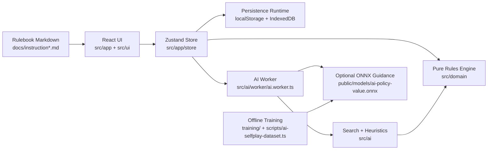
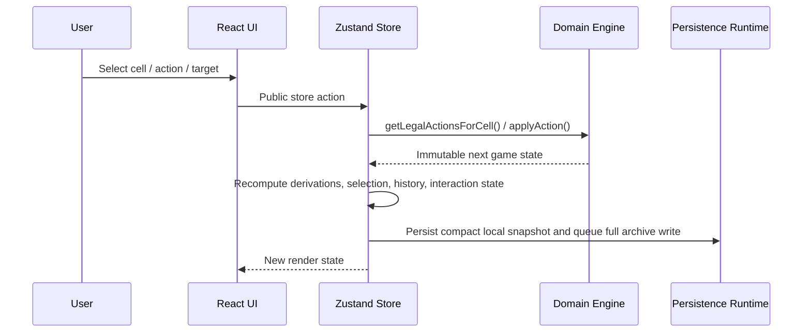
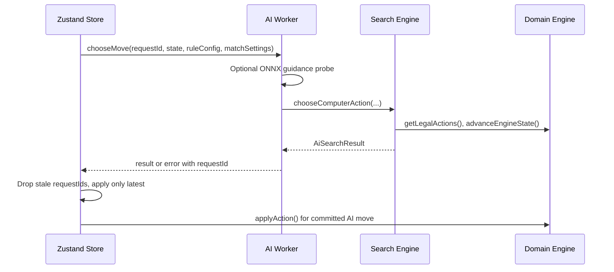
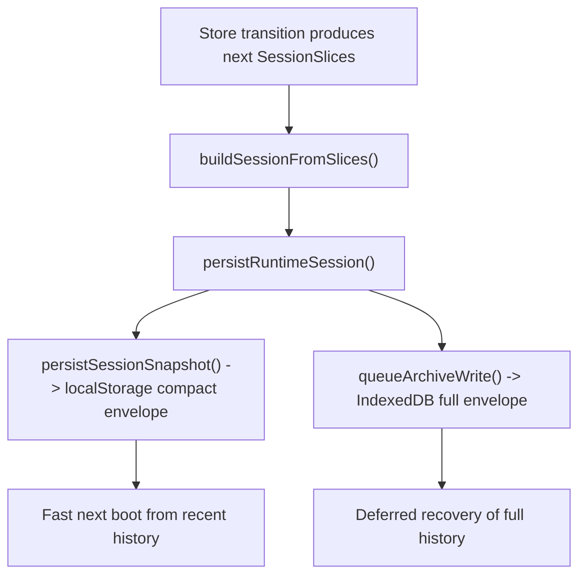

# White Maybe Black

**Copyright (c) 2026 Kostiantyn Stroievskyi. All Rights Reserved.**

No permission is granted to use, copy, modify, merge, publish, distribute, sublicense, or sell copies of this software or any portion of it, for any purpose, without explicit written permission from the copyright holder.

-----

**White Maybe Black** is a local-first implementation of a two-player abstract board game on a `6x6` board. The repository is not only a playable browser application: it also contains the pure rules engine, a browser-side AI, a persistence/migration layer, offline training code for an optional guidance model, and benchmarking/reporting scripts.

The project is intentionally split so that the game rules remain independent from React, browser storage, and rendering. That separation is the main architectural idea of the codebase: every layer above the rules engine is allowed to orchestrate or present state, but only the domain layer is allowed to define what a legal position or legal move is.

## Reading Order

If you need to understand the repository without reading the code first, read the documentation in this order:

1. [`docs/instruction.md`](./docs/instruction.md) or [`docs/instruction.ru.md`](./docs/instruction.ru.md): the canonical human-facing rulebook.
2. [`src/domain/README.md`](./src/domain/README.md): the authoritative explanation of the pure rules engine.
3. This file: how the full application is assembled around that engine.
4. [`src/ai/README.md`](./src/ai/README.md): the browser AI, its search pipeline, and the offline model path.
5. [`training/README.md`](./training/README.md): the offline training pipeline for the optional ONNX guidance model.

## What The Product Actually Does

At runtime the application supports two modes:

- `hotSeat`: two humans share one device; a pass-device overlay can hide the board between turns.
- `computer`: the store sends immutable engine state to a web worker, the worker runs the AI, and the UI applies only the latest result.

The rules revolve around six concepts:

- every board cell may contain a single checker or a stack of up to three checkers;
- the top checker controls a stack;
- only single checkers may be jumped over;
- jumping over enemy singles freezes them;
- jumping over your own frozen singles unfreezes them;
- victory is either complete home-field conversion or six fully owned height-3 stacks on the front home row.

Optional rules are modelled explicitly rather than hidden in the UI:

- non-adjacent friendly stack transfer;
- threefold repetition trigger (when enabled), with draw-resolution tiebreak;
- informational score mode.

Draw resolution used by both threefold and stalemate outcomes:

- compare own checkers on own home field;
- if tied, compare completed own height-3 stacks on own home field;
- if still tied, keep draw.

## System Overview



The key design consequence of this structure is that almost every important state transition can be traced to one of three authoritative places:

- rules and legality: `src/domain/`
- orchestration, persistence, and user interaction flow: `src/app/store/`
- move selection for the computer opponent: `src/ai/`

## Repository Map

| Path | Purpose | Why it exists |
| --- | --- | --- |
| [`src/domain/`](./src/domain/) | Pure rules engine, validation, history snapshots, session serialization | Keeps legality deterministic and reusable across UI, tests, persistence, and AI |
| [`src/ai/`](./src/ai/) | Search engine, heuristics, model encoding, worker bridge | Lets the computer opponent depend on the same rules engine instead of duplicating logic |
| [`src/app/`](./src/app/) | App shell, Zustand store factory, overlays, provider | Owns runtime orchestration and top-level composition |
| [`src/ui/`](./src/ui/) | Board, panels, tabs, primitives | Pure presentation and input surfaces over store state |
| [`src/shared/`](./src/shared/) | i18n catalog, session types, utilities, constants, hooks | Cross-cutting infrastructure used by app and UI layers |
| [`src/features/glossary/`](./src/features/glossary/) | Rule glossary entries shown in tooltips | Converts dense rule terminology into contextual explanations |
| [`docs/`](./docs/) | Canonical rulebook plus older design notes | Human-facing game specification and historical project notes |
| [`scripts/`](./scripts/) | Performance and AI-report entry points | Repeatable operational tooling outside the shipping app bundle |
| [`training/`](./training/) | Python training script and requirements | Offline policy/value model training, separate from browser runtime |
| [`public/models/`](./public/models/) | Deployment slot for `ai-policy-value.onnx` | Lets the browser lazily load optional model guidance without bundling it |
| [`output/`](./output/) | Generated reports | Stores non-source artifacts from benchmarks and AI analysis |

## Runtime Architecture

### 1. Human Move Flow



The UI never decides legality on its own. It asks the store for what can be selected, and the store derives that from the domain engine.

### 2. Computer Move Flow



This design matters because it prevents a class of subtle bugs: the AI can never mutate live UI state directly, and the UI can never “special-case” AI legality. Both are forced through the same immutable rule engine.

## Core State Concepts

The repository uses a few state concepts repeatedly. Understanding them once makes the rest of the codebase much easier to read.

| Concept | Where it lives | Meaning in the larger design |
| --- | --- | --- |
| `GameState` | [`src/domain/model/types.ts`](./src/domain/model/types.ts) | The authoritative runtime position, including board, side to move, terminal status, history, and repetition counts |
| `StateSnapshot` | [`src/domain/model/types.ts`](./src/domain/model/types.ts) | A history-safe, serialization-safe position snapshot without `history` or `positionCounts` |
| `TurnRecord` | [`src/domain/model/types.ts`](./src/domain/model/types.ts) | One committed move plus before/after snapshots, auto-passes, and the canonical position hash after the move |
| `UndoFrame` | [`src/shared/types/session.ts`](./src/shared/types/session.ts) | A lightweight cursor into the shared turn log, used to keep undo/redo compact |
| `InteractionState` | [`src/shared/types/session.ts`](./src/shared/types/session.ts) | The UI interaction state machine: idle, selecting, targeting, jump follow-up, pass overlay, or game over |
| `AiSearchResult` | [`src/ai/types.ts`](./src/ai/types.ts) | The complete output of one AI search, including the chosen action, diagnostics, fallbacks, and root candidate list |

## Store State Model

The Zustand store is not a random collection of fields. It is a runtime assembly of five conceptually different slices:

| Slice | Representative fields | Why this slice exists |
| --- | --- | --- |
| Session truth | `ruleConfig`, `preferences`, `matchSettings`, `gameState`, `turnLog`, `past`, `future` | This is the part that must survive persistence, import/export, and replay |
| Session cursor | `historyCursor`, `historyHydrationStatus` | Separates “what the session is” from “how much of it has been hydrated into memory right now” |
| Selection / interaction | `selectedCell`, `selectedActionType`, `selectedTargetMap`, `availableActionKinds`, `legalTargets`, `draftJumpPath`, `interaction` | Turns raw legality into a stepwise input protocol the UI can render safely |
| Derived read models | `selectableCoords`, `scoreSummary` | Caches expensive domain-derived views so components do not recompute them independently |
| Asynchronous peripherals | `aiStatus`, `aiError`, `pendingAiRequestId`, `lastAiDecision`, `importBuffer`, `importError`, `exportBuffer` | Isolates browser-worker and import/export concerns from the pure session itself |

Two details matter here:

- `setupMatchSettings` is intentionally separate from `matchSettings`. The former is editable draft configuration in the setup UI; the latter is the committed configuration of the live match.
- `turnLog` plus `past`/`future` is intentionally redundant only in appearance. `turnLog` stores the shared canonical chronology once, while undo/redo stores cheap cursors (`UndoFrame`) into that chronology.

## Persistence And Session History

Persistence is layered, not monolithic:

- the domain layer owns session JSON compatibility (`v1`, `v2`, `v3`) and runtime validation;
- the app layer wraps that session inside a persisted envelope for browser storage;
- the store writes a compact recent-history snapshot to `localStorage` and a full session archive to IndexedDB when available.

This split exists for a reason:

- `localStorage` is synchronous and cheap to read during boot;
- full session history can be larger, so it is archived asynchronously;
- the UI can start quickly from a compact recent window, then hydrate the full archive afterward.

Important versioning detail:

- the browser storage key namespace is `white-maybe-black/session/v4`;
- the persisted envelope schema version is `1`;
- the wrapped serializable session payload is currently `version: 3`.

Those numbers refer to different layers, so they are not expected to match.

## Store Bootstrap And Storage Pipeline

The exact store bootstrap path is:

```text
createGameStore()
  -> getInitialPersistenceState()
  -> createGameStoreStateRuntime()
  -> createStore(runtime.stateCreator)
  -> runPostCreate()
```

Each step has a distinct responsibility:

1. `createGameStore()` chooses the concrete browser facilities to use for this store instance:
   - `localStorage` for synchronous boot-time reads;
   - IndexedDB archive for asynchronous full-history recovery;
   - test doubles when the caller injects them.
2. `getInitialPersistenceState()` performs the best possible synchronous boot read:
   - if an explicit `initialSession` was injected, it wins immediately;
   - otherwise it prefers the current `v4` compact envelope in `localStorage`;
   - if only legacy payloads exist, it migrates them forward;
   - if nothing exists, it creates a default session.
3. `createGameStoreStateRuntime()` converts that session into live store slices, creates derivation caches, wires AI control, and wires persistence callbacks.
4. `runPostCreate()` performs side effects that must happen after the store object exists:
   - persist a migrated/default boot session if needed;
   - start async archive hydration if IndexedDB is available;
   - trigger the AI immediately if the restored state is already the computer's turn.

### Storage write path

After every committed session mutation, the pipeline is:



This split is the core storage design of the application:

- `localStorage` stores a compact recent-history window built by `createCompactSession()`;
- IndexedDB stores the full session history envelope;
- the compact snapshot is optimized for fast startup, not archival completeness;
- the archive is optimized for completeness, not synchronous boot latency.

### Hydration states and what they mean

`historyHydrationStatus` is intentionally explicit:

| Status | Meaning |
| --- | --- |
| `hydrating` | The store booted from a default or compact snapshot and is still trying to recover the full archive |
| `recentOnly` | The store is valid, but only the compact recent-history window is available |
| `full` | The full session history is present in memory |

The startup mode and the hydration status are different ideas:

- `startupHydrationMode` is an internal boot policy used only while the archive recovery race is still unresolved;
- `historyHydrationStatus` is the externally visible truth the UI can render.

### Why both compact and full persistence exist

The session model includes full turn history, undo frames, position counts, and match metadata. That is valuable, but it can also become large. The code therefore uses a two-tier storage policy:

- compact snapshot: enough recent history to preserve continuity and local undo/redo after reload;
- full archive: the complete session for long-running matches, exports, and history browsing.

Without that split, the application would have to choose between slow synchronous boot or incomplete persistence semantics.

## Undo/Redo And Interaction Flow

The store deliberately separates chronological truth from UI input state.

### Undo/redo model

Undo/redo is built from three structures:

| Structure | Purpose |
| --- | --- |
| `turnLog` | One canonical log of committed turns |
| `past` | Undo frames pointing to older cursors in that log |
| `future` | Redo frames pointing to newer cursors in that log |

When the user undoes:

1. the store restores the previous `UndoFrame`;
2. it reconstructs `gameState.history` from `turnLog.slice(0, historyCursor)`;
3. it keeps the canonical turn log intact instead of cloning separate histories for each branch.

That design keeps persistence compact and makes archive hydration deterministic.

### Interaction state machine

The interaction state is also explicit, because White Maybe Black has a genuinely multi-step move protocol:

| State | Why it exists |
| --- | --- |
| `idle` | No active selection |
| `pieceSelected` | A source cell is selected and the user must choose an action kind |
| `choosingTarget` | The user chose a non-jump action and now chooses a legal target |
| `buildingJumpChain` | The user is in the special same-turn jump flow |
| `jumpFollowUp` | A jump segment already committed and the same player may continue jumping |
| `turnResolved` | Human move committed; UI may briefly show handoff state |
| `passingDevice` | Hot-seat privacy overlay between human turns |
| `gameOver` | Terminal state; interaction becomes read-only |

This matters because the UI is intentionally not allowed to improvise game flow. The store owns the interaction protocol, and it derives that protocol from the domain engine's legal actions and `pendingJump` state.

## Why The Store Is So Modular

The store is broken into focused modules instead of one large Zustand object because each module has a different job and failure mode:

- [`stateCreator.ts`](./src/app/store/createGameStore/stateCreator.ts): assembles one store instance and post-create boot hooks;
- [`transitions.ts`](./src/app/store/createGameStore/transitions.ts): coordinates pure engine mutations, history, persistence, and AI sync;
- [`aiController.ts`](./src/app/store/createGameStore/aiController.ts): owns worker lifecycle, request ids, and timeouts;
- [`persistence.ts`](./src/app/store/createGameStore/persistence.ts) and [`persistenceRuntime.ts`](./src/app/store/createGameStore/persistenceRuntime.ts): own boot hydration, compact/full snapshot policy, and migration behavior;
- [`selection.ts`](./src/app/store/createGameStore/selection.ts): converts raw legality into UI interaction states;
- [`derivations.ts`](./src/app/store/createGameStore/derivations.ts): memoizes expensive board/cell derivations such as selectable coordinates and score summary.

That modularity is not accidental style; it is what keeps the application readable despite combining game rules, persistence, and asynchronous AI.

## UI Composition

The UI is intentionally thin. Most components do one of three things:

- project store state into a visible surface;
- dispatch a single store action;
- lazily load non-critical UI like overlays or dialogs.

The main structure is:

- [`src/app/App/App.tsx`](./src/app/App/App.tsx): shell, top navigation, tab switching, overlay preloading;
- [`src/ui/tabs/GameTab/GameTab.tsx`](./src/ui/tabs/GameTab/GameTab.tsx): gameplay screen, responsive layout split between board and panels;
- [`src/ui/board/Board/Board.tsx`](./src/ui/board/Board/Board.tsx): board grid, axes, and cell rendering;
- [`src/ui/panels/`](./src/ui/panels/): match setup, move input, history, status, settings, export/import;
- [`src/ui/tooltips/GlossaryTooltip/`](./src/ui/tooltips/GlossaryTooltip/): contextual rule explanations pulled from [`src/features/glossary/terms.ts`](./src/features/glossary/terms.ts).

The instructions tab is also data-driven: it renders the markdown rulebook in [`docs/instruction.md`](./docs/instruction.md) and [`docs/instruction.ru.md`](./docs/instruction.ru.md) through a deliberately small parser in [`src/ui/panels/InstructionsView/InstructionsView.tsx`](./src/ui/panels/InstructionsView/InstructionsView.tsx). That parser supports only the markdown features the repository actually uses: headings, paragraphs, ordered lists, unordered lists, horizontal rules, and inline bold text.

## AI And Offline Model Path

The computer opponent is search-first, not model-first.

- The runtime AI always works without any neural model.
- If `/models/ai-policy-value.onnx` exists, the worker loads it lazily and extracts masked policy priors for legal actions.
- Search still chooses the move. The model influences ordering; it does not replace the tree search.

The offline path is:

1. self-play data generation in [`scripts/ai-selfplay-dataset.ts`](./scripts/ai-selfplay-dataset.ts);
2. training in [`training/train_policy_value.py`](./training/train_policy_value.py);
3. ONNX export into [`public/models/`](./public/models/);
4. lazy runtime loading by [`src/ai/model/guidance.ts`](./src/ai/model/guidance.ts).

The detailed AI architecture, heuristics, and academic references live in [`src/ai/README.md`](./src/ai/README.md).

## Testing And Operational Scripts

### Application and engine tests

- `npm run test:run`: full Vitest suite.
- `src/domain/rules/*.test.ts`: rule engine behavior and session invariants.
- `src/ai/*.test.ts` plus [`src/ai/test/`](./src/ai/test/): search behavior, timeout handling, model plumbing, soak tests, and variety metrics.
- `src/app/store/*.test.ts` and `src/app/*.test.tsx`: store orchestration, rendering, persistence, and AI integration.

### Operational scripts

| Command | What it produces | Why it matters |
| --- | --- | --- |
| `npm run ai:selfplay` | self-play dataset JSONL | Generates supervised targets for the optional policy/value model |
| `npm run ai:variety` | `output/ai/ai-variety-report.{json,md}` | Measures diversity and behavioral quality of AI play |
| `npm run perf:report` | Playwright + domain performance reports | Benchmarks engine speed, root-ordering reuse, weak-device CPU profiles, and imported late-game browser AI turns |

The performance report now covers two complementary layers:

- domain microbenchmarks and root-ordering cache measurements on deterministic `opening`, `turn50`, `turn100`, and `turn200` states;
- shipped-browser measurements on mobile `1x`, `4x`, and `6x` CPU profiles, including hard-AI replies on imported late-game sessions.

## Design Principles That Recur Throughout The Code

1. **Domain purity over convenience.** The rules engine is intentionally ignorant of React, storage, and browser APIs.
2. **Immutable public transitions.** The reducer returns new state snapshots even when it uses structural sharing internally.
3. **History is a first-class artifact.** Turn records, undo frames, and position hashes are not debugging leftovers; they are central to persistence, replay, AI heuristics, and draw detection.
4. **Asynchronous work is isolated.** The AI worker and archive hydration both have request/version tokens so stale results cannot overwrite newer state.
5. **Optional features degrade gracefully.** The ONNX model, IndexedDB archive, and pass-device overlay can all be absent without breaking the core game.

## Where To Go Next

- For exact legality, invariants, and serialization rules: [`src/domain/README.md`](./src/domain/README.md)
- For search heuristics, worker protocol, model encoding, and academic lineage: [`src/ai/README.md`](./src/ai/README.md)
- For offline training commands: [`training/README.md`](./training/README.md)
