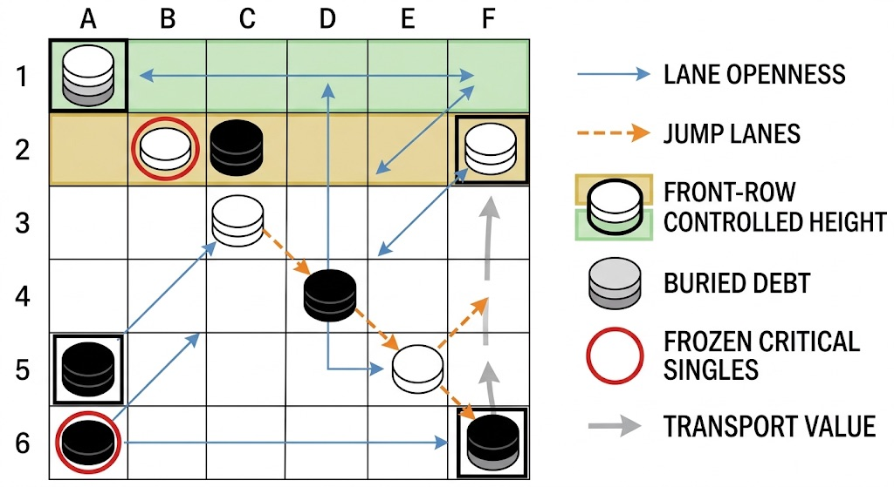
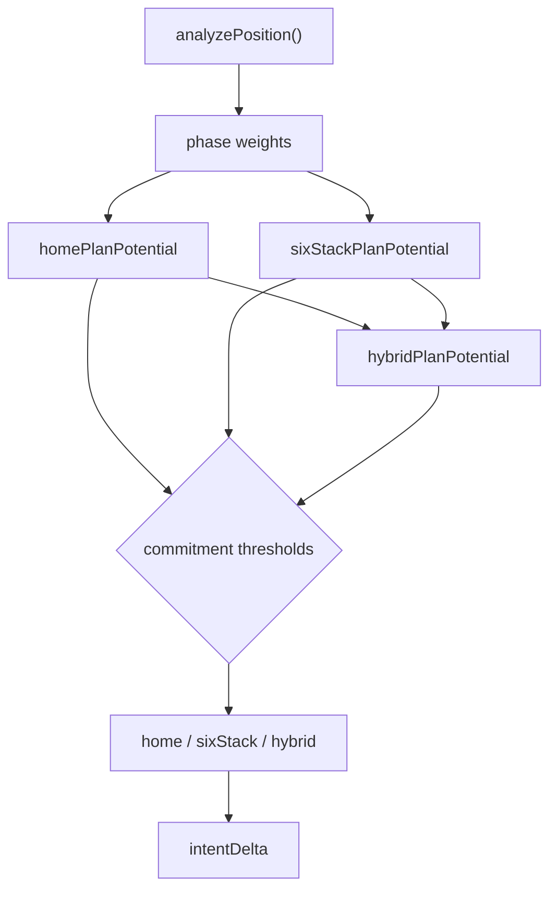
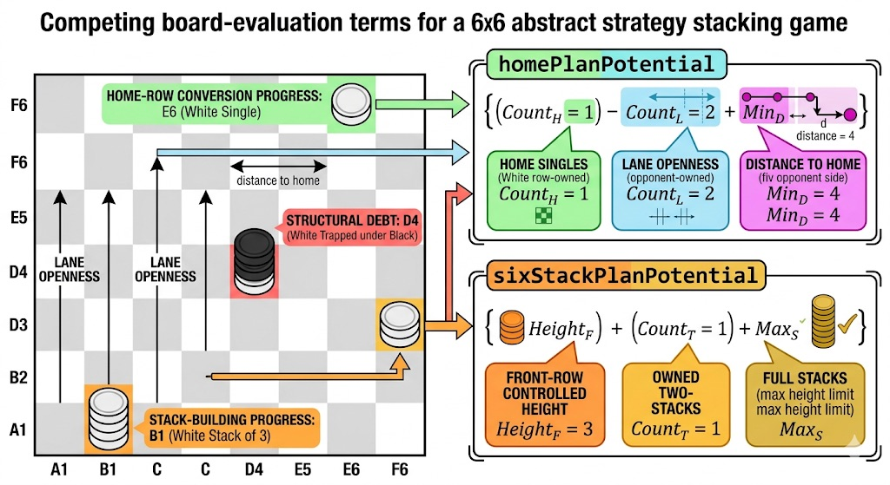
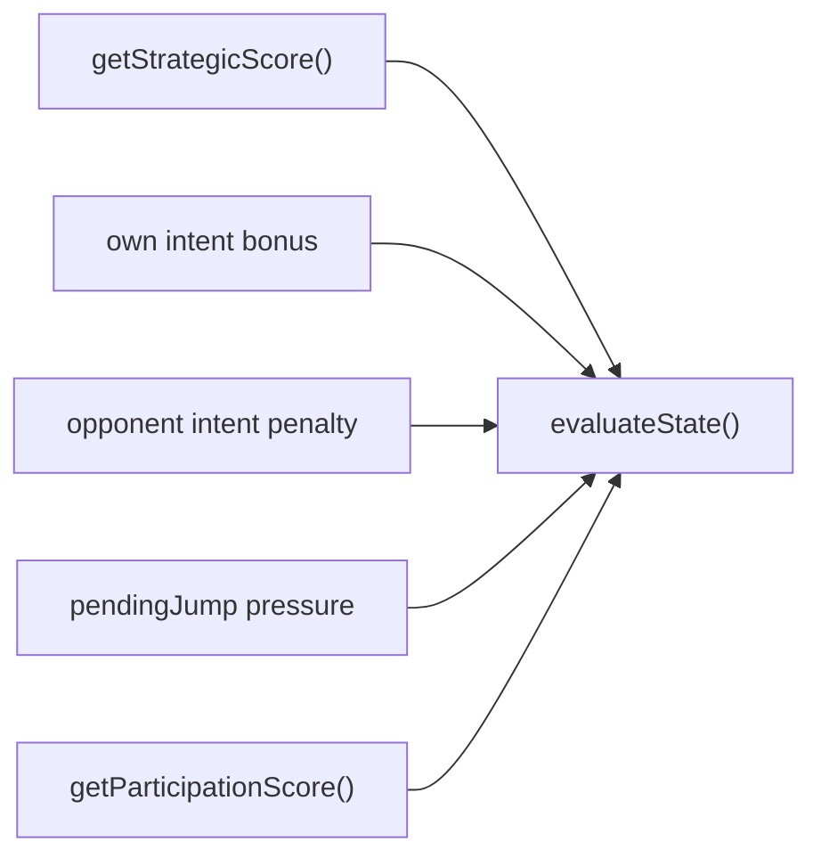
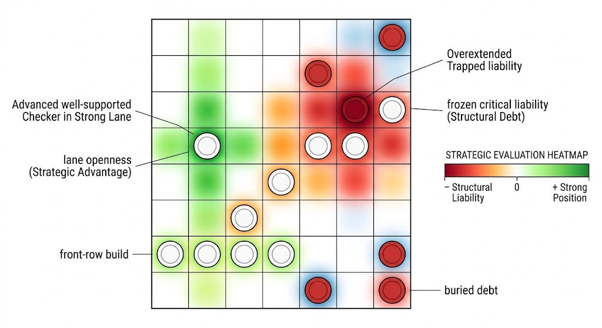
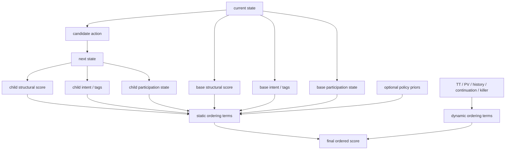
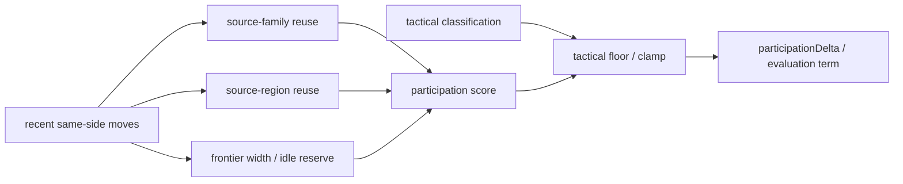
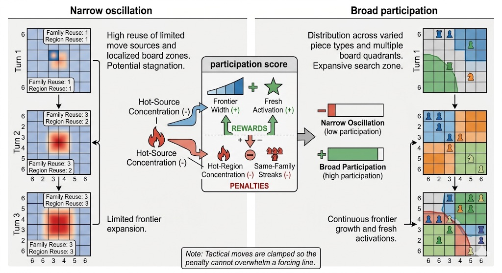

# Heuristic Reference

**Copyright (c) 2026 Kostiantyn Stroievskyi. All Rights Reserved.**

No permission is granted to use, copy, modify, merge, publish, distribute, sublicense, or sell copies of this software or any portion of it, for any purpose, without explicit written permission from the copyright holder.

---

This document is the exact, code-backed reference for YOUI's non-search scoring layer. It explains the current formulas in:

- [`evaluation.ts`](./evaluation.ts)
- [`strategy.ts`](./strategy.ts)
- [`participation.ts`](./participation.ts)
- [`moveOrdering.ts`](./moveOrdering.ts)
- [`presets.ts`](./presets.ts)

The AI is deliberately split into two responsibilities:

- search discovers tactical consequences;
- heuristics estimate which branches deserve attention first and how quiet leaf positions should be valued.

The goal of this document is precision. All constants below are taken from source, and every formula described here reflects the current implementation rather than an aspirational design.

## 1. Strategic Analysis (`strategy.ts`)

`strategy.ts` interprets the board as a structural planning problem. It does not count exact legal moves. Instead, it extracts a reusable summary of how much each side is progressing toward the two win conditions.

### Position-wide feature scan

`analyzePosition()` runs one cached board scan and builds a `PositionAnalysis` with per-player features:

| Feature | Meaning |
| --- | --- |
| `buriedDebt` | Cost of own material trapped under stacks, weighted more harshly when the stack is enemy-controlled |
| `controlledStacks` | Number of stacks currently controlled by the player |
| `controlledEnemyStacks` | Controlled stacks that contain enemy material |
| `emptyAdjacency` | Count of empty neighboring cells around active movers |
| `frontRowControlledHeight` | Total stack height the player controls on the front home row |
| `frontRowFullStacks` | Count of fully owned height-3 stacks on the front home row |
| `frontRowOwnedTwoStacks` | Count of fully owned height-2 stacks on the front home row |
| `frozenSingles` | Count of frozen single checkers |
| `frozenCriticalSingles` | Frozen singles on either the player's home rows or front home row |
| `homeSingles` | Number of own single checkers already on own home rows |
| `jumpLanes` | Cheap structural estimate of jump-ready lanes |
| `laneOpenness` | `emptyAdjacency * 2 + jumpLanes * 3` |
| `movableUnits` | Active singles plus controlled stacks that can contribute to mobility |
| `totalDistanceToHome` | Aggregate distance remaining for all checkers to reach own home rows |
| `transportValue` | Aggregate value of stack transport and active mobility potential |

The analysis also derives a coarse macro phase:

| Phase | Trigger |
| --- | --- |
| `conversion` | High home-row saturation or obvious stack-conversion progress |
| `opening` | Very few empty cells remain |
| `transport` | Everything between those two extremes |



*This image belongs in the strategic-analysis section because the underlying scan is spatial before it is numeric. The formulas later in the file are built on top of board features such as lane openness, front-row mass, buried debt, and frozen critical singles.*

### Phase weights

`getPhaseWeights()` reweights the same raw features depending on the inferred phase:

| Phase | `home` | `lane` | `stack` | `transport` |
| --- | ---: | ---: | ---: | ---: |
| `opening` | `0.85` | `1.3` | `0.9` | `1.1` |
| `transport` | `1` | `1.05` | `1.05` | `1.2` |
| `conversion` | `1.35` | `0.8` | `1.3` | `0.95` |

These weights do not replace the base terms; they selectively amplify or suppress them depending on whether the game still needs space creation, mass transport, or terminal conversion.

## 2. Intent Profile Formulas

`buildIntentProfile()` projects the structural scan into three competing narratives:

- `home`: convert all 18 checkers into own-home singles;
- `sixStack`: build six controlled height-3 stacks on the front home row;
- `hybrid`: stay between those commitments when the position is not yet polarized.

### Home-plan potential

For the acting player `p`:

```text
homePlanPotential =
  homeSingles * 420 * homeWeight +
  laneOpenness * 38 * laneWeight +
  jumpLanes * 70 +
  emptyAdjacency * 10 +
  transportValue * 8 * transportWeight -
  totalDistanceToHome * 28 -
  buriedDebt * 70 -
  frozenSingles * 110 -
  frozenCriticalSingles * 90 -
  controlledStacks * 42
```

Interpretation:

- the evaluator rewards already-converted own-home singles heavily;
- it still values lane creation and transport because the home-field win depends on reaching open landing space;
- it penalizes stacks, because the home-field objective wants singles rather than stored mass.

### Six-stack potential

```text
sixStackPlanPotential =
  frontRowControlledHeight * 210 * stackWeight +
  frontRowOwnedTwoStacks * 950 +
  frontRowFullStacks * 2700 +
  controlledStacks * 120 +
  controlledEnemyStacks * 180 +
  transportValue * 16 * transportWeight +
  jumpLanes * 24 -
  frozenCriticalSingles * 65 -
  totalDistanceToHome * 8 -
  buriedDebt * 25
```

Interpretation:

- front-row mass and completed height-3 stacks dominate this plan;
- controlled enemy material is valuable because mixed stacks can still be converted into controlled front-row structures;
- distance-to-home matters less than in the home-field plan because stack conversion is less dependent on every checker finishing as a single.

### Hybrid potential

```text
hybridPlanPotential =
  round(homePlanPotential * 0.58 + sixStackPlanPotential * 0.42) +
  round((own.laneOpenness - opp.laneOpenness) * 12) -
  round((own.frozenCriticalSingles - opp.frozenCriticalSingles) * 65)
```

`hybrid` is not a separate win condition. It is a temporary valuation used when the board does not yet justify a hard commitment to either terminal objective.

### Commitment thresholds

Let:

```text
delta = sixStackPlanPotential - homePlanPotential
```

`buildIntentProfile()` commits as follows:

- choose `sixStack` if `frontRowFullStacks >= 2`, or `frontRowControlledHeight >= 9`, or `delta >= 750`;
- choose `home` if `homeSingles >= 9`, or `homePlanPotential - sixStackPlanPotential >= 750`;
- otherwise choose `hybrid`.

`intentDelta` is:

- `delta` for `sixStack`;
- `homePlanPotential - sixStackPlanPotential` for `home`;
- `abs(delta)` for `hybrid`.

Those thresholds are the exact current commitment gates. They are not symbolic placeholders.



## 3. Strategic Score

`getStrategicScore()` converts the intent profiles into the scalar position score shared by evaluation and move ordering:

```text
getStrategicScore(state, player) =
  getIntentScore(ownProfile) -
  getIntentScore(opponentProfile) +
  (own.laneOpenness - opp.laneOpenness) * 22 +
  (own.jumpLanes - opp.jumpLanes) * 46 +
  (opp.frozenSingles - own.frozenSingles) * 95 +
  (opp.frozenCriticalSingles - own.frozenCriticalSingles) * 120
```

Where `getIntentScore(profile)` is:

- `homePlanPotential` for `home`;
- `sixStackPlanPotential` for `sixStack`;
- `hybridPlanPotential` for `hybrid`.

Important distinction:

- `buildIntentProfile()` decides which long-horizon story the side currently fits;
- `getStrategicScore()` values the position by contrasting both sides' stories and adding direct lane/freeze asymmetries.



*The point of this illustration is not to replace the formulas above. It is to show, on one board, that strategic evaluation is aggregating visibly different kinds of structure: progress toward home conversion, front-row construction, and liabilities such as buried debt or frozen critical material.*

## 4. Static Evaluation (`evaluation.ts`)

### Terminal convention

Both evaluators return:

- `+1_000_000` for a terminal win from the perspective side;
- `-1_000_000` for a terminal loss;
- `0` for a draw.

The term is `TERMINAL_SCORE`, and it is used to dominate all heuristic bonuses.

### `evaluateStructureState()`

`evaluateStructureState(state, perspectivePlayer, ruleConfig)` is intentionally cheap:

```text
if terminal:
  return ±1_000_000 or 0
else:
  return getStrategicScore(state, perspectivePlayer)
```

This function exists mainly for move ordering, where relative structure deltas are more important than the full leaf evaluation.

### `evaluateState()`

`evaluateState()` is the full quiet-leaf evaluator:

```text
score = getStrategicScore(state, perspectivePlayer)

if own intent is home:      score += 120
if own intent is sixStack:  score += 90

if opponent intent is home:     score -= 60
if opponent intent is sixStack: score -= 60

if pendingJump exists:
  score += 140  if state.currentPlayer === perspectivePlayer
  score -= 140  otherwise

if preset is present:
  score += getParticipationScore(...)
```

What it does **not** include:

- no direct model value term;
- no policy-prior term;
- no exact tactical mobility count.

Model `valueEstimate` is surfaced in `AiModelGuidance` for diagnostics and tests, but it is not injected into `evaluateState()`.





*This kind of illustration is useful because evaluation terms are globally summed but locally caused. A board heatmap communicates where structural bonuses and liabilities are coming from without pretending that the runtime literally computes one independent score per square.*

## 5. Move Ordering (`moveOrdering.ts`)

`moveOrdering.ts` splits ordering into two passes:

- `precomputeOrderedActions()`: expensive, state-derived, depth-invariant features
- `orderPrecomputedMoves()`: depth-varying heuristic-table bonuses

That split matters because root ordering is reused across iterative deepening passes.

### Static terms

For each legal action, `precomputeOrderedActions()` computes:

```text
staticPromise =
  evaluateStructureState(nextState, actor) -
  evaluateStructureState(currentState, actor)
```

Then it builds `staticScore` from the following exact terms:

| Term | Value |
| --- | ---: |
| immediate win | `+100_000` |
| jump action | `+7_500` |
| manual unfreeze | `+5_500` |
| front-row stack growth | `+5_000` |
| move ending in own home field | `+2_500` |
| freeze swing | `freezeSwingBonus * 1_200` |
| structure delta | `clamp(staticPromise, 8_000)` |
| strategic delta | `clamp(intentDelta, 6_000)` |
| participation delta | `clamp(participationDelta, 2_400)` |
| semantic policy bias | `+policyBias` |
| model prior | `round(policyPrior * policyPriorWeight)` |
| novelty penalty | `-noveltyPenalty` |
| repetition penalty | `-repetitionPenalty * (repeatedPositionCount - 1)` |
| self-undo penalty | `-selfUndoPenalty` when `isSelfUndo && !isTactical` |

`clamp(value, limit)` bounds each signed term to `[-limit, limit]`.

### Dynamic terms

`orderPrecomputedMoves()` adds the search-table bonuses that evolve during the search:

| Term | Value |
| --- | ---: |
| transposition-table move (`ttMove`) | `+200_000` |
| principal-variation move (`pvMove`) | `+150_000` |
| history heuristic | capped at `+12_000` |
| continuation heuristic | capped at `+8_000` |
| killer move | `+9_000` |

The final ordering score is:

```text
score = staticScore + dynamicScore
```



### Auxiliary ordering features

`moveOrdering.ts` also computes the boolean classification used elsewhere in the search:

| Field | Meaning |
| --- | --- |
| `winsImmediately` | `nextState` is terminal and wins for the actor |
| `isForced` | immediate win or any terminal child |
| `isRepetition` | post-move position count exceeds one |
| `isSelfUndo` | action recreates the root grandparent position or directly reverses the player's previous action |
| `isTactical` | immediate win, jump, manual unfreeze, positive freeze swing, or semantic `freezeBlock` / `rescue` tag |

### Helper bonuses and penalties

#### `getFreezeSwingBonus()`

For one-segment jumps only:

- `+1` when the jump thaws one of the actor's own frozen singles;
- `+1` when the jump freezes an enemy active single;
- `0` otherwise.

#### `growsFrontRowStack()`

True when the action increases the height of a stack on the actor's front home row.

#### `improvesHomeField()`

True when the action lands on any of the actor's home rows.

#### `getNoveltyPenalty()`

```text
noveltyPenalty = 90
```

when the current move's semantic tag list is non-empty and every current tag already appeared in the previous same-side move's tag list. Otherwise:

```text
noveltyPenalty = 0
```

This is a semantic repetition penalty, not a position-hash repetition penalty.

## 6. Strategic Action Tags

`getActionStrategicProfile()` tags candidate moves according to how they change the structural analysis.

### Tag conditions

| Tag | Trigger |
| --- | --- |
| `openLane` | empty-cell count increases or own lane openness increases |
| `advanceMass` | own total distance to home decreases or own home singles increase |
| `freezeBlock` | opponent frozen singles or frozen critical singles increase |
| `rescue` | own frozen singles decrease or own buried debt decreases |
| `frontBuild` | own front-row controlled height, owned two-stacks, or full stacks increase |
| `captureControl` | target controller changes from non-player to player |
| `decompress` | own controlled stacks decrease, own buried debt decreases, or a stack move releases mass from a taller source into a lower target |

The returned `intentDelta` is:

```text
getIntentScore(nextIntent) - getIntentScore(baseIntent)
```

### Tag-derived `policyBias`

The semantic tags are also converted into a scalar bias:

| Tag | Bias |
| --- | ---: |
| `frontBuild` | `+260` |
| `advanceMass` | `+180` |
| `freezeBlock` | `+150` |
| `openLane` | `+120` |
| `captureControl` | `+90` |
| `rescue` | `+80` |
| `decompress` | `+60` |

When multiple tags apply, the biases are summed.

### Compact glossary

| Tag | Short reading |
| --- | --- |
| `advanceMass` | move material closer to the home-field objective |
| `captureControl` | finish the move with control of a previously foreign structure |
| `decompress` | release material from cramped stack geometry |
| `freezeBlock` | increase frozen obstruction on the opponent's side |
| `frontBuild` | improve front-row stack scaffolding |
| `openLane` | create space or jump-ready geometry |
| `rescue` | reduce own frozen or buried liabilities |

## 7. Participation (`participation.ts`)

Participation is YOUI's anti-oscillation layer. It tries to distinguish "good reuse under tactical pressure" from "narrow cycling because several quiet moves look structurally equal."

### Stored participation state

For each side, the rolling state records:

- recently moved checker ids;
- a source-family identity derived from the moved material;
- a coarse source-region label;
- hot-source and hot-region concentration counts;
- same-family and same-region reuse streaks.

The current window length is preset-dependent:

| Difficulty | `participationWindow` |
| --- | ---: |
| `easy` | `2` |
| `medium` | `3` |
| `hard` | `3` |

### Phase scaling

Participation pressure depends on the strategic phase:

| Phase | Scale |
| --- | ---: |
| `opening` | `1.25` |
| `transport` | `1` |
| `conversion` | `0.45` |

The engine pushes variety hardest when the board is still congested and eases off once the position becomes a concrete conversion race.

### Player participation score

`getPlayerParticipationScore()` computes:

```text
frontierWidth * frontierWidthWeight * phaseScale +
activeCheckerCount * participationBias * 0.45 * phaseScale +
distinctFamilyCount * familyVarietyWeight * phaseScale -
idleReserveMass * participationBias * 0.65 * phaseScale -
hotSourceConcentration * sourceReusePenalty * phaseScale -
hotRegionConcentration * familyVarietyWeight * 0.75 * phaseScale -
max(0, sameFamilyReuseStreak - 1) * sourceReusePenalty * phaseScale -
max(0, sameRegionReuseStreak - 1) * familyVarietyWeight * phaseScale
```

Where:

- `frontierWidth` is the number of files occupied by movable material;
- `idleReserveMass` is own reserve material not touched recently;
- `hotSourceConcentration` and `hotRegionConcentration` count repeated reuse beyond the first touch.

The board-level participation term used in evaluation is:

```text
getParticipationScore(state, perspective) =
  playerParticipationScore(perspective) -
  playerParticipationScore(opponent)
```

### Action participation delta

`getActionParticipationProfile()` computes how one move changes the acting side's participation quality:

```text
participationDelta = afterScore - beforeScore

participationDelta += freshCheckerCount * participationBias * 1.2 * phaseScale
participationDelta += max(0, after.frontierWidth - before.frontierWidth) *
  frontierWidthWeight * 1.1 * phaseScale
participationDelta += max(0, before.idleReserveMass - after.idleReserveMass) *
  participationBias * 0.85 * phaseScale
```

Additional penalties:

```text
if no fresh checker was activated and reusedCheckerCount > 0:
  participationDelta -= reusedCheckerCount * sourceReusePenalty * 0.75 * phaseScale

if repeatsSourceFamily:
  participationDelta -= sourceReusePenalty * 0.8 * phaseScale

if repeatsSourceRegion:
  participationDelta -= familyVarietyWeight * 0.6 * phaseScale
```



Tactical clamping:

- if the move wins immediately, `participationDelta` is floored at `0`;
- if the move is tactical but not an immediate win, it is floored at `-round(sourceReusePenalty * 0.5 * phaseScale)`.

This is the mechanism that lets the engine keep anti-loop pressure on quiet turns without punishing forced tactical reuse too harshly.



*The participation layer distinguishes healthy tactical reuse from narrow quiet cycling by tracking families, regions, and frontier breadth over recent turns.*

## 8. Preset-Supplied Coefficients

Some heuristic formulas are not hard-coded in the evaluator itself; they are supplied by the difficulty preset.

| Difficulty | `policyPriorWeight` | `repetitionPenalty` | `selfUndoPenalty` | `participationBias` | `familyVarietyWeight` | `sourceReusePenalty` | `frontierWidthWeight` |
| --- | ---: | ---: | ---: | ---: | ---: | ---: | ---: |
| `easy` | `80` | `120` | `220` | `14` | `30` | `70` | `20` |
| `medium` | `140` | `180` | `320` | `18` | `42` | `100` | `28` |
| `hard` | `220` | `240` | `420` | `24` | `56` | `140` | `36` |

These are exact runtime values from [`presets.ts`](./presets.ts).

## 9. What This File Does Not Describe

This reference is intentionally limited to heuristic scoring. For adjacent concerns:

- search orchestration, negamax, PVS, quiescence, and lineage: [`README.md`](./README.md)
- rule legality, jump semantics, and state invariants: [`../domain/README.md`](../domain/README.md)
