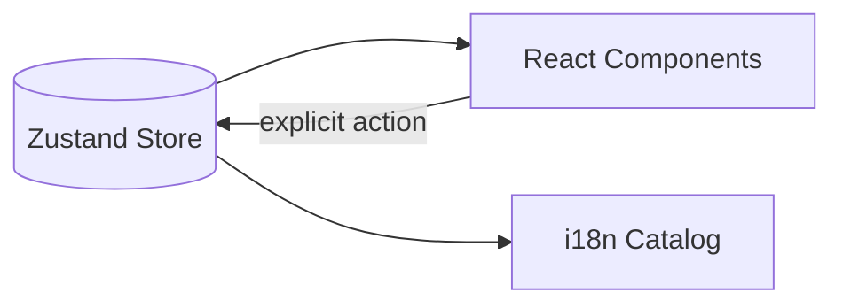
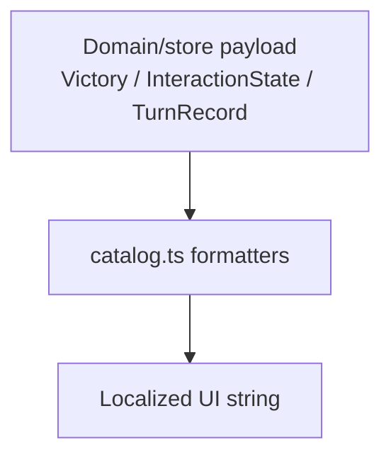

# UI Integration and i18n Strategy

**Copyright (c) 2026 Kostiantyn Stroievskyi. All Rights Reserved.**

No permission is granted to use, copy, modify, merge, publish, distribute, sublicense, or sell copies of this software or any portion of it, for any purpose, without explicit written permission from the copyright holder.

---

`src/ui/` is the presentation layer for YOUI. It renders store-derived state, emits explicit store actions, and owns responsive composition, but it does not define game legality, victory, or AI behavior. Those responsibilities remain in the domain engine and the store.

That separation matters because the game has several interaction states that are easy to misrender if the view improvises: pending jump continuations, computer-turn locks, pass-device overlays, imported history cursors, and rule-dependent action availability. The UI stays reliable by projecting those decisions rather than re-deriving them.

## Architectural Boundary

The core rule is simple:

- the UI may render board cells, action buttons, history, and overlays;
- the UI may dispatch user intent;
- the UI may not infer whether a move is legal.

In practice that means:

- board cells such as [`BoardCell.tsx`](./cells/BoardCell/BoardCell.tsx) and stacks such as [`CheckerStack.tsx`](./pieces/CheckerStack/CheckerStack.tsx) are memoized visual primitives;
- gameplay layout is assembled in [`GameTab.tsx`](./tabs/GameTab/GameTab.tsx);
- interaction text and victory phrasing come from [`src/shared/i18n/catalog.ts`](../shared/i18n/catalog.ts);
- the instructions tab renders the raw rulebook files through [`InstructionsView.tsx`](./panels/InstructionsView/InstructionsView.tsx).

At the component level the contract is intentionally narrow:

1. a component receives already-derived props such as coordinates, highlights, labels, or status;
2. it renders those props without trying to infer additional rule meaning;
3. on interaction it emits one explicit store action rather than performing local move logic.

## Responsive Composition

The main responsive split happens in [`GameTab.tsx`](./tabs/GameTab/GameTab.tsx) via [`useIsMobileViewport(960)`](../shared/hooks/useIsMobileViewport.ts). The same `960`-pixel breakpoint also drives compact history behavior in [`HistorySection.tsx`](./panels/HistorySection/HistorySection.tsx).

- Compact layout prioritizes the board, a small summary panel, and [`MobileGameTray.tsx`](./tabs/GameTab/MobileGameTray.tsx).
- Desktop layout keeps persistent auxiliary panels through [`DesktopScoreStrip.tsx`](./tabs/GameTab/DesktopScoreStrip.tsx) and [`GameControlPanel.tsx`](./panels/GameControlPanel/GameControlPanel.tsx).

This is not only a styling choice. The gameplay surface needs different affordances on mobile because the board must stay square and legible while still leaving room for move input, status, and history.

## Rendering Discipline

Several UI components are wrapped in `memo`, including [`Board.tsx`](./board/Board/Board.tsx), [`BoardCell.tsx`](./cells/BoardCell/BoardCell.tsx), and [`CheckerStack.tsx`](./pieces/CheckerStack/CheckerStack.tsx). That optimization works because the domain layer uses structural sharing when it applies moves: untouched cells keep their object identity, so the UI can skip re-rendering unchanged board regions.

The important point is not the memoization itself. The important point is that the optimization is safe only because the domain engine, not the view layer, owns immutable state transitions.

In practical React terms, unchanged cells can be skipped through referential equality checks because structural sharing preserves object identity for untouched board regions.

That is the same optimization boundary the rest of the repository relies on: the view benefits from structural sharing, but it does not implement structural sharing itself.

## Localization Model

Localization is centered in [`src/shared/i18n/catalog.ts`](../shared/i18n/catalog.ts) and its supporting files:

- [`catalog/text.ts`](../shared/i18n/catalog/text.ts): static UI copy;
- [`catalog/labels.ts`](../shared/i18n/catalog/labels.ts): enum and action labels;
- [`catalog/copy.ts`](../shared/i18n/catalog/copy.ts): formatter functions for interaction and victory text.

Those pieces have different jobs:

| Catalog layer | Purpose |
| --- | --- |
| `text.ts` | static UI copy |
| `labels.ts` | enum-to-label mapping for actions and other code-level vocabularies |
| `copy.ts` | dynamic formatting for interaction, history, and victory text |

The catalog exports explicit formatting helpers such as:

- `text(language, key)`
- `actionLabel(language, actionKind)`
- `describeInteraction(language, interaction)`
- `formatVictory(language, victory)`
- `formatTurnRecord(language, record)`

That approach keeps React components free from bilingual branching logic and keeps rule-dependent phrasing close to the domain vocabulary it describes.

### Why dynamic resolvers exist

Not all strings are static labels. Victory messages, interaction prompts, and move-history records depend on structured runtime payloads. The catalog therefore separates:

- static keys for fixed copy;
- label maps for enum-like vocabularies;
- formatter functions for grammar-sensitive dynamic output.

Concrete examples from the current catalog surface:

- `describeInteraction(language, interaction)` formats states such as `jumpFollowUp` and `choosingTarget` from the typed interaction payload rather than from ad-hoc component conditionals.
- `formatVictory(language, victory)` expands tiebreak-heavy payloads such as `threefoldTiebreakWin` into strings that include whether the decision came from own-field checkers or completed home stacks, plus the supporting counts for both players.

That is why components do not need to know how to phrase something like a threefold tiebreak or a jump-follow-up prompt in each language.

## Rulebook Rendering

[`InstructionsView.tsx`](./panels/InstructionsView/InstructionsView.tsx) imports [`docs/instruction.md`](../../docs/instruction.md) and [`docs/instruction.ru.md`](../../docs/instruction.ru.md) as raw strings and parses only the subset of Markdown the project actually uses:

- headings
- paragraphs
- ordered lists
- unordered lists
- horizontal rules
- inline bold spans

The parser is intentionally narrow. The goal is stable in-app rendering of the repository's own rulebook, not general-purpose Markdown support.

## Glossary Surface

The glossary subsystem lives at the boundary between product UX and documentation:

- terms are authored in [`src/features/glossary/terms.ts`](../features/glossary/terms.ts);
- trigger widgets live in [`GlossaryTooltip.tsx`](./tooltips/GlossaryTooltip/GlossaryTooltip.tsx);
- the dialog is lazy-loaded from [`GlossaryTooltipDialog.tsx`](./tooltips/GlossaryTooltip/GlossaryTooltipDialog.tsx).

This keeps dense rule vocabulary accessible in context without turning the gameplay surface into a permanently expanded manual.

## What This Layer Deliberately Does Not Do

`src/ui/` does not:

- generate legal actions;
- mutate the game state directly;
- interpret AI diagnostics;
- define persistence behavior;
- resolve turn ownership after jumps or auto-passes.

Those omissions are intentional. The UI stays maintainable because it is allowed to be visually rich while remaining rule-poor.
