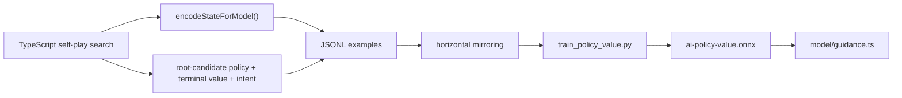

# AI Training Pipeline

**Copyright (c) 2026 Kostiantyn Stroievskyi. All Rights Reserved.**

No permission is granted to use, copy, modify, merge, publish, distribute, sublicense, or sell copies of this software or any portion of it, for any purpose, without explicit written permission from the copyright holder.

---

This directory contains the offline training path for YOUI's optional neural guidance model. The browser AI does not depend on this pipeline at runtime: search, evaluation, and move legality all remain fully operational when no model file exists. Training exists to improve move ordering through policy priors and to surface a diagnostic value estimate.

## Runtime Relationship

The trained artifact is loaded by [`src/ai/model/guidance.ts`](../src/ai/model/guidance.ts) from the deployment slot documented in [`public/models/README.md`](../public/models/README.md).

Current runtime behavior is intentionally narrow:

- policy logits are masked down to currently legal actions and used as move-ordering priors;
- `valueEstimate` is surfaced in `AiModelGuidance` for diagnostics and tests;
- the search does **not** inject the value head into [`evaluateState()`](../src/ai/evaluation.ts).

That separation keeps tactical correctness in the classical search while letting offline learning improve the quality of the order in which the tree is explored.

## Dataset Shape

Self-play data is generated by [`scripts/ai-selfplay-dataset.ts`](../scripts/ai-selfplay-dataset.ts). Each JSONL row contains:

- `planes`: a flattened `16 x 6 x 6` state tensor from [`encodeStateForModel()`](../src/ai/model/encoding.ts);
- `policy`: a sparse policy target derived from the ranked root candidates returned by `chooseComputerAction()`;
- `value`: terminal outcome from the acting player's perspective in `[-1, 1]`;
- `intent`: the heuristic strategic intent label (`home`, `sixStack`, or `hybrid`) chosen at search time.

The generator also mirrors every recorded position horizontally. That doubles the dataset size while teaching the model that left-right reflections are equivalent game states.

The generator's default rules are intentionally fixed:

- `drawRule: 'threefold'`
- `scoringMode: 'off'`
- deterministic seeded randomness per game index through `createSeededRandom(gameIndex + 1)`



## Model Shape

[`train_policy_value.py`](./train_policy_value.py) trains a compact residual policy/value network:

- input: `16` planes on a `6 x 6` board;
- trunk: `4` residual blocks with `32` channels;
- policy head: dense logits over the fixed `2_736`-action space from [`src/ai/model/actionSpace.ts`](../src/ai/model/actionSpace.ts);
- value head: a scalar `tanh` output in `[-1, 1]`;
- optimizer: `AdamW`;
- loss: policy cross-entropy plus value MSE.

The architecture is deliberately modest. YOUI is not trying to replace search with a large end-to-end policy network; it is trying to give a bounded browser search a better prior.

## Workflow

1. Generate self-play data from the TypeScript engine:

```bash
npm run ai:selfplay -- --games=64 --difficulty=hard --out=output/training/self-play.jsonl
```

1. Create a virtual environment and install Python dependencies:

```bash
python3 -m venv .venv
source .venv/bin/activate
pip install -r training/requirements.txt
```

1. Train and export the ONNX model:

```bash
python3 training/train_policy_value.py \
  --input output/training/self-play.jsonl \
  --output public/models/ai-policy-value.onnx
```

## Constraints And Trade-Offs

- The dataset is self-play data from the current search engine, so the model learns the engine's current policy biases as well as its strengths.
- The exported artifact is optimized for local browser inference through `onnxruntime-web`, not for maximum research throughput.
- Because the runtime currently consumes only policy priors, a stronger value head improves diagnostics first and move choice only indirectly.

For the runtime loading path and fallback behavior, see [`public/models/README.md`](../public/models/README.md) and [`src/ai/README.md`](../src/ai/README.md).
